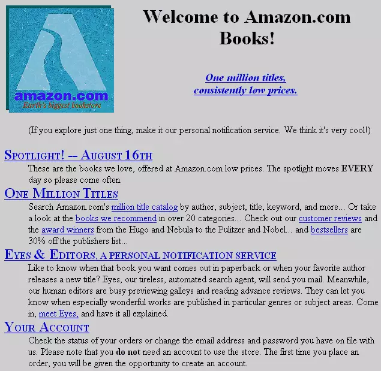
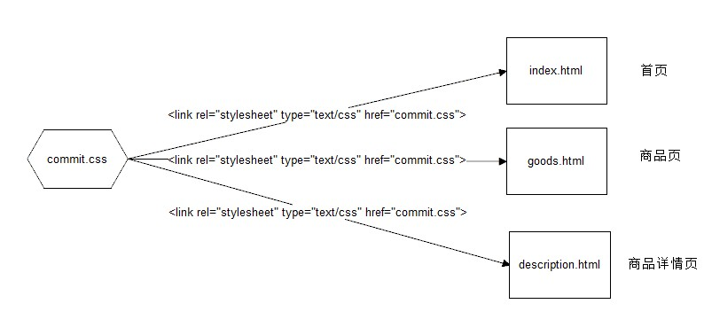

# 今日内容
1.css概念
2.css样式的引用方式
3.基础选择器
4.扩展选择器
5.css常用属性
6.css三大特征

# 1. css概念

## 1.1 html的局限性

说起HTML，这其实是个非常单纯的家伙， 他只关注内容的语义，    
比如`<h1>`表明这是一个大标题，用`<p>` 表明这是一个段落，用 表明这儿有一个图片， 用`<a>` 表示此处有链接。   
很早的时候，世界上的网站虽然很多，但是他们都有一个共同的特点： **丑**。  
这个是一个外国比较早的购物网站 
   
有些人就忍受不了了，你就不能把自己打扮得漂亮一点吗？
HTML说，我试试...
  
如果要改变下 高度或者变一个颜色，就需要大量重复操作
**总结**  
* HTML满足不了设计者的需求，且操作属性不方便；
* HTML里面添加样式带来的是无尽的臃肿和繁琐

## 1.2 css的作用

使用html标签属性对页面修饰的方式存着很大的不足和局限：
样式都写在html标签中，既不利于阅读，也不利于后续代码的维护；
需要结构和表现分离。即在页面设计中，html标签只用于搭建网页和基础结构，样式由css来进行设置。


**CSS(Cascading Style Sheets)**  ，通常称为CSS样式表或层叠样式表（级联样式表）

* 主要用于**设置** HTML页面中的文本内容（字体、大小、对齐方式等）、图片的外形（宽高、边框样式、边距等）以及**版面的布局和外观显示样式。**

# 2.css样式的引用方式

## 2.1 行内式（内联样式）
是通过标签的style属性来设置元素的样式。  
基本语法如下：      
    `<标签名 style="属性1:属性值1; 属性2:属性值2; 属性3:属性值3;"> 内容 </标签名>`     
实际上任何HTML标签都拥有style属性，用来设置行内式。  
案例： 
~~~html
<div style="color: red; font-size: 12px;">青春不常在，抓紧谈恋爱</div>   
~~~
**注意事项**


* style其实就是标签的属性
* 样式属性和值中间是`:`
* 多组属性值之间用`;`隔开；
* 只能控制当前的标签和以及嵌套在其中的字标签，造成代码冗余
* 缺点：
    * 没有实现样式和结构的分离。

## 2.2 内嵌式（内部样式表）   

是将CSS代码集中写在HTML文档的head头部标签中，并且用style标签定义。   
基本语法结构如下：   
~~~html
    <head>     
        <style type="text/CSS">
            选择器（选择的标签） {    
            属性1: 属性值1;    
            属性2: 属性值2;    
            属性3: 属性值3;    
        }
        </style>
    </head> 
~~~
   例如： 
~~~html
    <style>
        div {
            color: red;
            font-size: 12px;
        }
    </style>
~~~
- style标签一般位于head标签中，当然理论上他可以放在HTML文档的任何地方。
- type="text/css"  在html5中可以省略。
- 只能控制当前的页面
- 缺点：没有彻底分离


## 2.3 外链式（外部样式表）

称链入式,是将所有的样式放在一个或多个以**.CSS**为扩展名的外部样式表文件中，通过link标签将外部样式表文件链接到HTML文档中    
语法：
~~~html
    <head>
      <link rel="stylesheet" type="text/css" href="css文件路径">
    </head>
~~~
* 注意：
    - link 是个单标签
    - link标签需要放在head头部标签中，并且指定link标签的三个属性

| 属性 | 作用                                                         |
| ---- | :----------------------------------------------------------- |
| rel  | 定义当前文档与被链接文档之间的关系，在这里需要指定为“stylesheet”，表示被链接的文档是一个样式表文件。 |
| type | 定义所链接文档的类型，在这里需要指定为“text/CSS”，表示链接的外部文件为CSS样式表。我们都可以省略 |
| href | 定义所链接外部样式表文件的URL，可以是相对路径，也可以是绝对路径。 |



## 2.4 三种样式表总结
| 样式表     | 优点                     | 缺点                     | 使用情况       | 控制范围           |
| ---------- | ------------------------ | ------------------------ | -------------- | ------------------ |
| 行内样式表 | 书写方便，权重高         | 没有实现样式和结构相分离 | 较少           | 控制一个标签（少） |
| 内部样式表 | 部分结构和样式相分离     | 没有彻底分离             | 较多           | 控制一个页面（中） |
| 外部样式表 | 完全实现结构和样式相分离 | 需要引入                 | 最多，强烈推荐 | 控制整个站点（多） |

# 3.基础选择器

## 3.1 选择器的作用

CSS选择器干啥的？   选择标签用的， 把我们想要的标签选择出来。选出来以后，就可以对标签进行格式设置了   
css 就是 分两件事， 选对人，  做对事。 

    h3 {
    color: red;
    }


这段代码就是2件事， 把  h3选出来， 然后 把它变成了 红色。 以后我们都这么干。     

## 3.2 标签选择器

顾名思义，选标签。**HTML标签名**称作为选择器，按标签名称分类，为页面中某一类标签指定统一的CSS样式
语法结构：

    标签名{属性1:属性值1; 属性2:属性值2; 属性3:属性值3; }

- 作用：   
  标签选择器 可以把某一类标签**全部**选择出来  比如所有的div标签  和 所有的 span标签

- 优点：   
  是能快速为页面中同类型的标签统一样式

- 缺点：   
  不能设计差异化样式。


## 3.3 类选择器

类选择器使用“.”（英文点号）进行标识，后面紧跟类名.     
语法：     
    
    .类名  {   
    属性1:属性值1;
    属性2:属性值2;
    属性3:属性值3;     
    }

例如：标签
~~~html
<p class='类名'></p> <!*  类名可以放置多个，用空格隔开 *>
~~~
* 优点：
    - 可以为元素对象定义单独或相同的样式。 可以选择一个或者多个标签


## 3.4 id选择器

id选择器使用`#`进行标识，后面紧跟id名。其基本语法格式如下：

- id选择器

~~~
    #id名 {属性1:属性值1; 属性2:属性值2; 属性3:属性值3; }
~~~

- 标签
  ~~~html
  <p id="id名"></p>
  ~~~
  
* W3C标准规定，在同一个页面内，不允许有相同名字的id对象出现，但是允许相同名字的class。
- 类选择器（class） 好比人的名字，  是可以多次重复使用的， 比如  张伟  王伟  李伟  李娜
- id选择器     好比人的身份证号码，  全中国是唯一的， 不得重复。 只能使用一次。

## 3.5 通配符选择器

概念：通配符选择器用`*`号表示，  *   就是 选择所有的标签     是所有选择器中作用范围最广的，能匹配页面中所有的元素。

- 其基本语法格式如下：
```
* { 属性1:属性值1; 属性2:属性值2; 属性3:属性值3; }
```

例如下面的代码，使用通配符选择器定义CSS样式，清除所有HTML标记的默认边距。

```css
* {
  margin: 0;                    /* 定义外边距*/
  padding: 0;                   /* 定义内边距*/
}
```

- 注意：
通配符选择器会匹配页面所有的元素，降低页面响应速度，不建议随便使用

## 3.6 基础选择器总结

| 选择器       | 作用                          | 缺点                     | 使用情况   | 用法                 |
| ------------ | ----------------------------- | ------------------------ | ---------- | -------------------- |
| 标签选择器   | 可以选出所有相同的标签，比如p | 不能差异化选择           | 较多       | p { color：red;}     |
| 类选择器     | 可以选出1个或者多个标签       | 可以根据需求选择         | 非常多     | .nav { color: red; } |
| id选择器     | 一次只能选择器1个标签         | 只能使用一次             | 不推荐使用 | #nav {color: red;}   |
| 通配符选择器 | 选择所有的标签                | 选择的太多，有部分不需要 | 不推荐使用 | * {color: red;}      |

# 4.扩展选择器

## 4.1 后代选择器

后代选择器又称为包含选择器，用来选择元素或元素组的**子孙后代**
其写法就是把外层标签写在前面，内层标签写在后面，中间用**空格**分隔，先写父亲爷爷，再写儿子孙子。
~~~
父级 子级{属性:属性值;属性:属性值;}
~~~
例如：
~~~html
.class h3{color:red;font-size:16px;}
~~~

## 4.2 子元素选择器
子元素选择器只能选择作为某元素**子元素(亲儿子)**的元素。
其写法就是把父级标签写在前面，子级标签写在后面，中间跟一个 `>` 进行连接
~~~
.class>h3{color:red;font-size:14px;}
~~~
这里的子 指的是 **亲儿子**  不包含孙子 重孙子之类。
~~~
 比如：  .demo > h3 {color: red;}   说明  h3 一定是demo 亲儿子。  demo 元素包含着h3。
~~~

## 4.3 交集选择器
交集选择器由两个选择器构成，找到的标签必须满足：既有标签一的特点，也有标签二的特点。
交集选择器 是 **并且**的意思。  即...又...的意思

~~~html
比如：   p.one   选择的是： 类名为 .one  的 段落标签。  
~~~

## 4.4 并集选择器
如果某些选择器定义的相同样式，就可以利用并集选择器，可以让代码更简洁。
~~~
比如  .one, p , #test {color: #F00;}  
表示   .one 和 p  和 #test 这三个选择器都会执行颜色为红色。 
通常用于集体声明。 
~~~

##  4.5 链接伪类选择器

- a:link      /* 未访问的链接 */
- a:visited   /* 已访问的链接 */
- a:hover     /* 鼠标移动到链接上 */
- a:active    /* 选定的链接 */
**写的时候，他们的顺序尽量不要颠倒  按照  lvha 的顺序。否则可能引起错误。**
  
~~~html
a {   /* a是标签选择器  所有的链接 */
      font-weight: 700;
      font-size: 16px;
      color: gray;
}
a:hover {   /* :hover 是链接伪类选择器 鼠标经过 */
      color: red; /*  鼠标经过的时候，由原来的 灰色 变成了红色 */
}
~~~

## 4.6 复合选择器总结

| 选择器         | 作用                     | 特征                 | 使用情况 | 隔开符号及用法                          |
| -------------- | ------------------------ | -------------------- | -------- | --------------------------------------- |
| 后代选择器     | 用来选择元素后代         | 是选择所有的子孙后代 | 较多     | 符号是**空格** .nav a                   |
| 子代选择器     | 选择 最近一级元素        | 只选亲儿子           | 较少     | 符号是**>**   .nav>p                    |
| 交集选择器     | 选择两个标签交集的部分   | 既是 又是            | 较少     | **没有符号**  p.one                     |
| 并集选择器     | 选择某些相同样式的选择器 | 可以用于集体声明     | 较多     | 符号是**逗号** .nav, .header            |
| 链接伪类选择器 | 给链接更改状态           |                      | 较多     | 重点记住 a{} 和 a:hover  实际开发的写法 |

# 5.css常用属性

## 5.1 字体、文本
  * font-size：字体大小
  * color：文本颜色
  * text-align：对其方式
  * line-height：行高 
## 5.2 边框
  * border：设置边框，符合属性
## 5.3 背景
* background：
## 5.4 尺寸
  * width：宽度
  * height：高度
## 5.5 盒子模型：控制布局 相关属性
**所谓的外边距和内边距，一定是从不同视角来看的。在那个元素中设置内外边距，就是以这个元素为基准。**
  * margin：外边距
  * padding：内边距
      * 默认情况下内边距会影响整个盒子的大小
      * box-sizing: border-box;  设置盒子的属性，让width和height就是最终盒子的大小
  * float：浮动
      * left
      * right


# 6.css三大特征
三大特征：层叠性，CSS继承性， CSS优先级
## 6.1 css的层叠性
所谓层叠性是指多种CSS样式的叠加。
是浏览器处理冲突的一个能力,如果一个属性通过两个相同选择器设置到同一个元素上，那么这个时候一个属性就会将另一个属性层叠掉
- 原则：
    - 样式冲突，遵循的原则是**就近原则。** 那个样式离着结构近，就执行那个样式。
    - 样式不冲突，不会层叠
    
~~~
CSS层叠性最后的执行口诀：  长江后浪推前浪，前浪死在沙滩上。   
~~~

# 6.2 CSS继承性

* 概念：子标签会继承父标签的某些样式，如文本颜色和字号。想要设置一个可继承的属性，只需将它应用于父元素即可。

 
**注意**：
- 恰当地使用继承可以简化代码，降低CSS样式的复杂性。比如有很多子级孩子都需要某个样式，可以给父级指定一个，这些孩子继承过来就好了。
- 子元素可以继承父元素的样式（**text-，font-，line-这些元素开头的可以继承，以及color属性**）

# 6.3 CSS优先级(难点)

* 概念：定义CSS样式时，经常出现两个或更多规则应用在同一元素上，此时，
    * 选择器相同，则执行层叠性
    * 选择器不同，就会出现优先级的问题。

* 权重计算公式
关于CSS权重，我们需要一套计算公式来去计算，这个就是 CSS Specificity（特殊性）
  
  | 标签选择器             | 计算权重公式 |
  | ---------------------- | ------------ |
  | 继承或者 *             | 0,0,0,0      |
  | 每个元素（标签选择器） | 0,0,0,1      |
  | 每个类，伪类           | 0,0,1,0      |
  | 每个ID                 | 0,1,0,0      |
  | 每个行内样式 style=""  | 1,0,0,0      |
  | 每个!important  重要的 | ∞ 无穷大     |  

- 值从左到右，左面的最大，一级大于一级，数位之间没有进制，级别之间不可超越。
- 关于CSS权重，我们需要一套计算公式来去计算，这个就是 CSS Specificity（特殊性）
- div {
     color: pink!important;  //最高权限
  }

* 权重叠加
我们经常用交集选择器，后代选择器等，是有多个基础选择器组合而成，那么此时，就会出现权重叠加。  
就是一个简单的加法计算
- div ul  li   ------>      0,0,0,3
- .nav ul li   ------>      0,0,1,2
- a:hover      -----—>      0,0,1,1
- .nav a       ------>      0,0,1,1

**注意：**
~~~
 数位之间没有进制 比如说： 
     0,0,0,5 
  +  0,0,0,5 
  =  0,0,0,10 
 而不是 0,0, 1, 0，
 所以不会存在10个div能赶上一个类选择器的情况。
~~~

* 继承的权重是0
这个不难，但是忽略很容易绕晕。其实，我们修改样式，一定要看该标签有没有被选中。
1） 如果选中了，那么以上面的公式来计权重。谁大听谁的。
2） 如果没有选中，那么权重是0，因为继承的权重为0.
