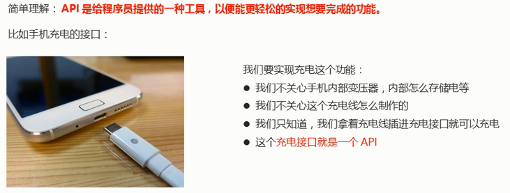
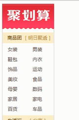

# day04 - Web APIs

> 学习目标：
> 能够通过ID来获取元素
> 能够通过标签名来获取元素
> 能够通过class来获取元素
> 能够通过选择器来获取元素
> 能够获取body和html元素
> 能够给元素注册事件
> 能够修改元素的内容
> 能够区分innerText和innerHTML的区别
> 能够修改像div这类普通元素的属性
> 能够修改元素的样式属性
> 能够根据提示完成百度换肤的案例
> 能够根据提示完成全选案例>
> 能够区分元素节点、文本节点、属性节点>
> 能够获取指定元素的父元素>
> 能够获取指定元素的所有子元素>
> 能够说出childNodes和children的区别>
> 能够使用createElement创建页面元素

## 1.1. Web API介绍

### 1.1.1 API的概念

API（Application Programming Interface，应用程序编程接口）是一些预先定义的函数，目的是提供应用程序与开发人员基于某软件或硬件得以访问一组例程的能力，而又无需访问源码，无需理解其内部工作机制细节，只需直接调用使用即可。




> 举例解释什么是API。
>
> 例如，
>
> ​	C语言中有一个函数 fopen()可以打开硬盘上的文件，这个函数对于我们来说，就是一个C语言提供的打开文件的工具。
>
> ​	javascript中有一个函数alert()可以在页面弹一个提示框，这个函数就是js提供的一个弹框工具。
>
> 这些工具（函数）由编程语言提供，内部的实现已经封装好了，我们只要学会灵活的使用这些工具即可。

### 1.1.2 Web  API的概念

​	Web API 是浏览器提供的一套操作浏览器功能和页面元素的 API ( BOM 和 DOM )。

​	现阶段我们主要针对于浏览器讲解常用的 API , 主要针对浏览器做交互效果。比如我们想要浏览器弹出一个警示框， 直接使用 alert(‘弹出’)

​	MDN 详细 API : https://developer.mozilla.org/zh-CN/docs/Web/API

​	因为 Web API 很多，所以我们将这个阶段称为 Web APIs。

​	此处的 Web API 特指浏览器提供的一系列API(很多函数或对象方法)，即操作网页的一系列工具。例如：操作html标签、操作页面地址的方法。

### 1.1.3 API 和 Web  API 总结

1. API 是为我们程序员提供的一个接口，帮助我们实现某种功能，我们会使用就可以了，不必纠结内部如何实现

2. Web API 主要是针对于浏览器提供的接口，主要针对于浏览器做交互效果。

3. Web API 一般都有输入和输出（函数的传参和返回值），Web API 很多都是方法（函数）

4. 学习 Web API 可以结合前面学习内置对象方法的思路学习

## 1.2. DOM 介绍

### 1.2.1 什么是DOM

​	文档对象模型（Document Object Model，简称DOM），是 [W3C](https://baike.baidu.com/item/W3C) 组织推荐的处理[可扩展标记语言](https://baike.baidu.com/item/%E5%8F%AF%E6%89%A9%E5%B1%95%E7%BD%AE%E6%A0%87%E8%AF%AD%E8%A8%80)（html或者xhtml）的标准[编程接口](https://baike.baidu.com/item/%E7%BC%96%E7%A8%8B%E6%8E%A5%E5%8F%A3)。

​	W3C 已经定义了一系列的 DOM 接口，通过这些 DOM 接口可以改变网页的内容、结构和样式。

> DOM是W3C组织制定的一套处理 html和xml文档的规范，所有的浏览器都遵循了这套标准。

### 1.2.2. DOM树


DOM树 又称为文档树模型，把文档映射成树形结构，通过节点对象对其处理，处理的结果可以加入到当前的页面。

- 文档：一个页面就是一个文档，DOM中使用document表示
- 节点：网页中的所有内容，在文档树中都是节点（标签、属性、文本、注释等），使用node表示
- 标签节点：网页中的所有标签，通常称为元素节点，又简称为“元素”，使用element表示


## 1.3. 获取元素

为什么要获取页面元素？

例如：我们想要操作页面上的某部分(显示/隐藏，动画)，需要先获取到该部分对应的元素，再对其进行操作。

### 1.3.1. 根据ID获取

```js
语法：document.getElementById(id)
作用：根据ID获取元素对象
参数：id值，区分大小写的字符串
返回值：元素对象 或 null
```

**案例代码**

```js
<body>
    <div id="time">2019-9-9</div>
    <script>
        // 因为我们文档页面从上往下加载，所以先得有标签 所以我们script写到标签的下面
        var timer = document.getElementById('time');
        console.log(timer);
        console.log(typeof timer);
        // console.dir 打印我们返回的元素对象 更好的查看里面的属性和方法
        console.dir(timer);
    </script>
</body>
```

### 1.3.2. 根据标签名获取元素

```
语法：document.getElementsByTagName('标签名') 或者 element.getElementsByTagName('标签名') 
作用：根据标签名获取元素对象
参数：标签名
返回值：元素对象集合（伪数组，数组元素是元素对象）
```

**案例代码**

```javascript
<body>
    <ul>
        <li>知否知否，应是等你好久11</li>
        <li>知否知否，应是等你好久22</li>
        <li>知否知否，应是等你好久33</li>
        <li>知否知否，应是等你好久44</li>
        <li>知否知否，应是等你好久55</li>
    </ul>
    <ul id="nav">
        <li>生僻字</li>
        <li>生僻字</li>
        <li>生僻字</li>
        <li>生僻字</li>
        <li>生僻字</li>
    </ul>
    <script>
        // 1.返回的是 获取过来元素对象的集合 以伪数组的形式存储的
        var lis = document.getElementsByTagName('li');
        console.log(lis);
        console.log(lis[0]);
        // 2. 我们想要依次打印里面的元素对象我们可以采取遍历的方式
        for (var i = 0; i < lis.length; i++) {
            console.log(lis[i]);
        }
        // 3. element.getElementsByTagName()  可以得到这个元素里面的某些标签
        var nav = document.getElementById('nav'); // 这个获得nav 元素
        var navLis = nav.getElementsByTagName('li');
        console.log(navLis);
    </script>
</body>
```


注意：getElementsByTagName()获取到是动态集合，即：当页面增加了标签，这个集合中也就增加了元素。

### 1.3.3. H5新增获取元素方式


**案例代码**

```js
<body>
    <div class="box">盒子1</div>
    <div class="box">盒子2</div>
    <div id="nav">
        <ul>
            <li>首页</li>
            <li>产品</li>
        </ul>
    </div>
    <script>
        // 1. getElementsByClassName 根据类名获得某些元素集合
        var boxs = document.getElementsByClassName('box');
        console.log(boxs);
        // 2. querySelector 返回指定选择器的第一个元素对象  切记 里面的选择器需要加符号 .box  #nav
        var firstBox = document.querySelector('.box');
        console.log(firstBox);
        var nav = document.querySelector('#nav');
        console.log(nav);
        var li = document.querySelector('li');
        console.log(li);
        // 3. querySelectorAll()返回指定选择器的所有元素对象集合
        var allBox = document.querySelectorAll('.box');
        console.log(allBox);
        var lis = document.querySelectorAll('li');
        console.log(lis);
    </script>
</body>
```

### 1.3.4 获取特殊元素（body，html）


## 1.4. 事件基础

### 1.4.1. 事件概述

JavaScript 使我们有能力创建动态页面，而事件是可以被 JavaScript 侦测到的行为。

简单理解： **触发--- 响应机制**。

​	网页中的每个元素都可以产生某些可以触发 JavaScript 的事件，例如，我们可以在用户点击某按钮时产生一个 事件，然后去执行某些操作。

### 1.4.2. 事件三要素

- 事件源（谁）：触发事件的元素
- 事件类型（什么事件）： 例如 click 点击事件
- 事件处理程序（做啥）：事件触发后要执行的代码(函数形式)，事件处理函数

**案例代码**

```js
<body>
    <button id="btn">唐伯虎</button>
    <script>
        // 点击一个按钮，弹出对话框
        // 1. 事件是有三部分组成  事件源  事件类型  事件处理程序   我们也称为事件三要素
        //(1) 事件源 事件被触发的对象   谁  按钮
        var btn = document.getElementById('btn');
        //(2) 事件类型  如何触发 什么事件 比如鼠标点击(onclick) 还是鼠标经过 还是键盘按下
        //(3) 事件处理程序  通过一个函数赋值的方式 完成
        btn.onclick = function() {
            alert('点秋香');
        }
    </script>
</body>
```

### 1.4.3. 执行事件的步骤


**案例代码**

```js
<body>
    <div>123</div>
    <script>
        // 执行事件步骤
        // 点击div 控制台输出 我被选中了
        // 1. 获取事件源
        var div = document.querySelector('div');
        // 2.绑定事件 注册事件
        // div.onclick 
        // 3.添加事件处理程序 
        div.onclick = function() {
            console.log('我被选中了');
        }
    </script>
</body>
```

### 1.4.4. 常见的鼠标事件


## 1.5. 操作元素

​	JavaScript的 DOM 操作可以改变网页内容、结构和样式，我们可以利用 DOM 操作元素来改变元素里面的内容、属性等。（注意：这些操作都是通过元素对象的属性实现的）

### 1.5.1. 改变元素内容（获取或设置）


**innerText改变元素内容**

**innerText和innerHTML的区别**

- 获取内容时的区别：

​	innerText会去除空格和换行，而innerHTML会保留空格和换行	

- 设置内容时的区别：

​	innerText不会识别html，而innerHTML会识别

**案例代码**

```js
<body>
    <div></div>
    <p>
        我是文字
        <span>123</span>
    </p>
    <script>
        // innerText 和 innerHTML的区别 
        // 1. innerText 不识别html标签 非标准  去除空格和换行
        var div = document.querySelector('div');
        // div.innerText = '<strong>今天是：</strong> 2019';
        // 2. innerHTML 识别html标签 W3C标准 保留空格和换行的
        div.innerHTML = '<strong>今天是：</strong> 2019';
        // 这两个属性是可读写的  可以获取元素里面的内容
        var p = document.querySelector('p');
        console.log(p.innerText);
        console.log(p.innerHTML);
    </script>
</body>
```

### 1.5.2. 常用元素的属性操作


**获取属性的值**

> 元素对象.属性名

**设置属性的值**

> 元素对象.属性名 = 值

**案例代码**

```js
<body>
    <button id="ldh">刘德华</button>
    <button id="zxy">张学友</button> <br>
    
    <script>
        // 修改元素属性  src
        // 1. 获取元素
        var ldh = document.getElementById('ldh');
        var zxy = document.getElementById('zxy');
        var img = document.querySelector('img');
        // 2. 注册事件  处理程序
        zxy.onclick = function() {
            img.src = 'images/zxy.jpg';
            img.title = '张学友思密达';
        }
        ldh.onclick = function() {
            img.src = 'images/ldh.jpg';
            img.title = '刘德华';
        }
    </script>
</body>
```


#### 方式1：通过操作style属性

> 元素对象的style属性也是一个对象！
>
> 元素对象.style.样式属性 = 值;


**案例代码**

```js
<body>
    <div></div>
    <script>
        // 1. 获取元素
        var div = document.querySelector('div');
        // 2. 注册事件 处理程序
        div.onclick = function() {
            // div.style里面的属性 采取驼峰命名法 
            this.style.backgroundColor = 'purple';
            this.style.width = '250px';
        }
    </script>
</body>
```


#### 方式2：通过操作className属性

> 元素对象.className = 值;
>
> 因为class是关键字，所有使用className。


**案例代码**

```js
<body>
    <div class="first">文本</div>
    <script>
        // 1. 使用 element.style 获得修改元素样式  如果样式比较少 或者 功能简单的情况下使用
        var test = document.querySelector('div');
        test.onclick = function() {
            // this.style.backgroundColor = 'purple';
            // this.style.color = '#fff';
            // this.style.fontSize = '25px';
            // this.style.marginTop = '100px';

            // 2. 我们可以通过 修改元素的className更改元素的样式 适合于样式较多或者功能复杂的情况
            // 3. 如果想要保留原先的类名，我们可以这么做 多类名选择器
            // this.className = 'change';
            this.className = 'first change';
        }
    </script>
</body>
```


## dom操作元素总结


## 1.6. 排他操作

### 1.6.1 排他思想


如果有同一组元素，我们想要某一个元素实现某种样式， 需要用到循环的排他思想算法：

1. 所有元素全部清除样式（干掉其他人）

2. 给当前元素设置样式 （留下我自己）

3. 注意顺序不能颠倒，首先干掉其他人，再设置自己

```js
    <button>按钮1</button>
    <button>按钮2</button>
    <button>按钮3</button>
    <button>按钮4</button>
    <button>按钮5</button>
    <script>
        // 1. 获取所有按钮元素
        var btns = document.getElementsByTagName('button');
        // btns得到的是伪数组  里面的每一个元素 btns[i]
        for (var i = 0; i < btns.length; i++) {
            btns[i].onclick = function() {
                // (1) 我们先把所有的按钮背景颜色去掉  干掉所有人
                for (var i = 0; i < btns.length; i++) {
                    btns[i].style.backgroundColor = '';
                }
                // (2) 然后才让当前的元素背景颜色为pink 留下我自己
                this.style.backgroundColor = 'pink';

            }
        }
    </script>
```


## 1.6.2 案例：百度换肤


```js
<body>
    <ul class="baidu">
        <li></li>
        <li></li>
        <li></li>
        <li></li>
    </ul>
    <script>
        // 1. 获取元素 
        var imgs = document.querySelector('.baidu').querySelectorAll('img');
        // console.log(imgs);
        // 2. 循环注册事件 
        for (var i = 0; i < imgs.length; i++) {
            imgs[i].onclick = function() {
                // this.src 就是我们点击图片的路径   images/2.jpg
                // console.log(this.src);
                // 把这个路径 this.src 给body 就可以了
                document.body.style.backgroundImage = 'url(' + this.src + ')';
            }
        }
    </script>
</body>
```

## 1.3 案例：表格隔行变色


```js
    <script>
        // 1.获取元素 获取的是 tbody 里面所有的行
        var trs = document.querySelector('tbody').querySelectorAll('tr');
        // 2. 利用循环绑定注册事件
        for (var i = 0; i < trs.length; i++) {
            // 3. 鼠标经过事件 onmouseover
            trs[i].onmouseover = function() {
                    // console.log(11);
                    this.className = 'bg';
                }
                // 4. 鼠标离开事件 onmouseout
            trs[i].onmouseout = function() {
                this.className = '';
            }
        }
    </script>
```

## 1.4 案例：全选


```js
    <script>
        // 1. 全选和取消全选做法：  让下面所有复选框的checked属性（选中状态） 跟随 全选按钮即可
        // 获取元素
        
        var j_cbAll = document.getElementById('j_cbAll'); 
        var j_tbs = document.getElementById('j_tb').getElementsByTagName('input'); 
        // 全选按钮注册事件
        j_cbAll.onclick = function() {
                // this.checked 当前复选框的选中状态
                console.log(this.checked);
                for (var i = 0; i < j_tbs.length; i++) {
                    j_tbs[i].checked = this.checked;
                }
         }
         // 给所有的子复选框注册单击事件
        for (var i = 0; i < j_tbs.length; i++) {
            j_tbs[i].onclick = function() {
                // flag 控制全选按钮是否选中
                var flag = true;
                // 每次点击下面的复选框都要循环检查者4个小按钮是否全被选中
                for (var i = 0; i < j_tbs.length; i++) {
                    if (!j_tbs[i].checked) {
                        flag = false;
                        break; 
                    }
                }
                // 设置全选按钮的状态
                j_cbAll.checked = flag;
            }
        }
    </script>
```


## 1.5. 自定义属性操作

### 1.5.1 获取属性值


```js
    <div id="demo" index="1" class="nav"></div>
    <script>
        var div = document.querySelector('div');
        // 1. 获取元素的属性值
        // (1) element.属性
        console.log(div.id);
        //(2) element.getAttribute('属性')  get得到获取 attribute 属性的意思 我们程序员自己添加的属性我们称为自定义属性 index
        console.log(div.getAttribute('id'));
        console.log(div.getAttribute('index'));
	</script>
```


### 1.5.2. 设置属性值


```js
        // 2. 设置元素属性值
        // (1) element.属性= '值'
        div.id = 'test';
        div.className = 'navs';
        // (2) element.setAttribute('属性', '值');  主要针对于自定义属性
        div.setAttribute('index', 2);
        div.setAttribute('class', 'footer'); // class 特殊  这里面写的就是
```

### 1.5.3. 移出属性


```js
		// class 不是className
        // 3 移除属性 removeAttribute(属性)    
        div.removeAttribute('index');
```

## 1.6. 节点操作

### 1.6.1. 节点概述

​	网页中的所有内容都是节点（标签、属性、文本、注释等），在DOM 中，节点使用 node 来表示。

​	HTML DOM 树中的所有节点均可通过 JavaScript 进行访问，所有 HTML 元素（节点）均可被修改，也可以创建或删除。


​	一般地，节点至少拥有nodeType（节点类型）、nodeName（节点名称）和nodeValue（节点值）这三个基本属性。


### 1.6.2. 节点层级

​	利用 DOM 树可以把节点划分为不同的层级关系，常见的是**父子兄层级关系**。

​    

### 1.6.3. 父级节点


```js
    <div class="demo">
        <div class="box">
            <span class="erweima">×</span>
        </div>
    </div>
    <script>
        // 1. 父节点 parentNode
        var erweima = document.querySelector('.erweima');
        // var box = document.querySelector('.box');
        // 得到的是离元素最近的父级节点(亲爸爸) 如果找不到父节点就返回为 null
        console.log(erweima.parentNode);
    </script>
```

### 1.6.4. 子节点

**所有子节点**


**子元素节点**


```js
    <ul>
        <li>我是li</li>
        <li>我是li</li>
        <li>我是li</li>
        <li>我是li</li>
    </ul>
    <script>
        // DOM 提供的方法（API）获取
        var ul = document.querySelector('ul');
        var lis = ul.querySelectorAll('li');
        // 1. 子节点  childNodes 所有的子节点 包含 元素节点 文本节点等等
        console.log(ul.childNodes);
        console.log(ul.childNodes[0].nodeType);
        console.log(ul.childNodes[1].nodeType);
        // 2. children 获取所有的子元素节点 也是我们实际开发常用的
        console.log(ul.children);
    </script>
```

**第1个子节点**


**最后1个子节点**


**第1个子元素节点**


**最后1个子元素节点**


​	实际开发中，firstChild 和 lastChild 包含其他节点，操作不方便，而 firstElementChild 和 lastElementChild 又有兼容性问题，那么我们如何获取第一个子元素节点或最后一个子元素节点呢？


```js
    <ol>
        <li>我是li1</li>
        <li>我是li2</li>
        <li>我是li3</li>
        <li>我是li4</li>
        <li>我是li5</li>
    </ol>
    <script>
        var ol = document.querySelector('ol');
        // 1. firstChild 第一个子节点 不管是文本节点还是元素节点
        console.log(ol.firstChild);
        console.log(ol.lastChild);
        // 2. firstElementChild 返回第一个子元素节点 ie9才支持
        console.log(ol.firstElementChild);
        console.log(ol.lastElementChild);
        // 3. 实际开发的写法  既没有兼容性问题又返回第一个子元素
        console.log(ol.children[0]);
        console.log(ol.children[ol.children.length - 1]);
    </script>
```


### 1.6.6. 兄弟节点


    <div>我是div</div>
    <span>我是span</span>
    <script>
        var div = document.querySelector('div');
        // 1.nextSibling 下一个兄弟节点 包含元素节点或者 文本节点等等
        console.log(div.nextSibling);
        console.log(div.previousSibling);
        // 2. nextElementSibling 得到下一个兄弟元素节点
        console.log(div.nextElementSibling);
        console.log(div.previousElementSibling);
    </script>


```js
   function getNextElementSibling(element) {
      var el = element;
      while (el = el.nextSibling) {
        if (el.nodeType === 1) {
            return el;
        }
      }
      return null;
    }  
```

### 1.6.7. 创建节点


### 1.6.8. 添加节点


```js
    <ul>
        <li>123</li>
    </ul>
    <script>
        // 1. 创建节点元素节点
        var li = document.createElement('li');
        // 2. 添加节点 node.appendChild(child)  node 父级  child 是子级 后面追加元素
        var ul = document.querySelector('ul');
        ul.appendChild(li);
        // 3. 添加节点 node.insertBefore(child, 指定元素);
        var lili = document.createElement('li');
        ul.insertBefore(lili, ul.children[0]);
        // 4. 我们想要页面添加一个新的元素 ： 1. 创建元素 2. 添加元素
    </script>
```


## 1.2. BOM

### 1.2.1. 什么是BOM

​	BOM（Browser Object Model）即浏览器对象模型，它提供了独立于内容而与浏览器窗口进行交互的对象，其核心对象是 window。

​	BOM 由一系列相关的对象构成，并且每个对象都提供了很多方法与属性。

​	BOM 缺乏标准，JavaScript 语法的标准化组织是 ECMA，DOM 的标准化组织是 W3C，BOM 最初是Netscape 浏览器标准的一部分。


### 1.2.2. BOM的构成

BOM 比 DOM 更大，它包含 DOM。


### 1.2.3. 顶级对象window


### 1.2.4. window对象的常见事件

#### 页面（窗口）加载事件（2种）

**第1种**


window.onload 是窗口 (页面）加载事件，**当文档内容完全加载完成**会触发该事件(包括图像、脚本文件、CSS 文件等), 就调用的处理函数。


**第2种**


​	DOMContentLoaded 事件触发时，仅当DOM加载完成，不包括样式表，图片，flash等等。

​	IE9以上才支持！！！

​	如果页面的图片很多的话, 从用户访问到onload触发可能需要较长的时间, 交互效果就不能实现，必然影响用户的体验，此时用 DOMContentLoaded 事件比较合适。

```js
    <script>
        window.addEventListener('load', function() {
            var btn = document.querySelector('button');
            btn.addEventListener('click', function() {
                alert('点击我');
            })
        })
        window.addEventListener('load', function() {
            alert(22);
        })
        document.addEventListener('DOMContentLoaded', function() {
            alert(33);
        })
    </script>
```


### 1.2.5. 定时器（两种）

window 对象给我们提供了 2 个非常好用的方法-定时器。

- setTimeout()

- setInterval()

#### setTimeout() 炸弹定时器

##### 开启定时器


> ```
> 普通函数是按照代码顺序直接调用。
> 
> 简单理解： 回调，就是回头调用的意思。上一件事干完，再回头再调用这个函数。
> 例如：定时器中的调用函数，事件处理函数，也是回调函数。
> 
> 以前我们讲的   element.onclick = function(){}   或者  element.addEventListener(“click”, fn);   里面的 函数也是回调函数。
> 
> ```


```js
    <script>
        // 回调函数是一个匿名函数
         setTimeout(function() {
             console.log('时间到了');

         }, 2000);
        function callback() {
            console.log('爆炸了');
        }
		// 回调函数是一个有名函数
        var timer1 = setTimeout(callback, 3000);
        var timer2 = setTimeout(callback, 5000);
    </script>
```

##### 案例：5秒后关闭广告




```js
<body>
    
    <script>
        // 获取要操作的元素
        var ad = document.querySelector('.ad');
		// 开启定时器
        setTimeout(function() {
            ad.style.display = 'none';
        }, 5000);
    </script>
</body>
```

##### 停止定时器


```js
    <button>点击停止定时器</button>
    <script>
        var btn = document.querySelector('button');
		// 开启定时器
        var timer = setTimeout(function() {
            console.log('爆炸了');
        }, 5000);
		// 给按钮注册单击事件
        btn.addEventListener('click', function() {
            // 停止定时器
            clearTimeout(timer);
        })
    </script>
```


#### setInterval() 闹钟定时器

##### 开启定时器


```js
    <script>
        // 1. setInterval 
        setInterval(function() {
            console.log('继续输出');
        }, 1000);
    </script>
```

##### 停止定时器

### 1.2.7. location对象

#### 什么是 location 对象
#### URL
#### location 对象的属性
#### 案例：5分钟自动跳转页面
```js
    <button>点击</button>
    <div></div>
    <script>
        var btn = document.querySelector('button');
        var div = document.querySelector('div');
        btn.addEventListener('click', function() {
            // console.log(location.href);
            location.href = 'http://www.hitwh.edu.cn';
        })
        var timer = 5;
        setInterval(function() {
            if (timer == 0) {
                location.href = 'http://www.hitwh.edu.cn';
            } else {
                div.innerHTML = '您将在' + timer + '秒钟之后跳转到首页';
                timer--;
            }
        }, 1000);
    </script>
```

#### 案例：获取URL参数


```js
    <div></div>
	<script>
        console.log(location.search); // ?uname=andy
        // 1.先去掉？  substr('起始的位置'，截取几个字符);
        var params = location.search.substr(1); // uname=andy
        console.log(params);
        // 2. 利用=把字符串分割为数组 split('=');
        var arr = params.split('=');
        console.log(arr); // ["uname", "ANDY"]
        var div = document.querySelector('div');
        // 3.把数据写入div中
        div.innerHTML = arr[1] + '欢迎您';
    </script>
```

#### location对象的常见方法


```js
    <button>点击</button>
    <script>
        var btn = document.querySelector('button');
        btn.addEventListener('click', function() {
            // 记录浏览历史，所以可以实现后退功能
            // location.assign('http://www.itcast.cn');
            // 不记录浏览历史，所以不可以实现后退功能
            // location.replace('http://www.itcast.cn');
            location.reload(true);
        })
    </script>
```

### 1.2.8. navigator对象

​	navigator 对象包含有关浏览器的信息，它有很多属性，我们最常用的是 userAgent，该属性可以返回由客户机发送服务器的 user-agent 头部的值。

下面前端代码可以判断用户那个终端打开页面，实现跳转

```js
if((navigator.userAgent.match(/(phone|pad|pod|iPhone|iPod|ios|iPad|Android|Mobile|BlackBerry|IEMobile|MQQBrowser|JUC|Fennec|wOSBrowser|BrowserNG|WebOS|Symbian|Windows Phone)/i))) {
    window.location.href = "";     //手机
 } else {
    window.location.href = "";     //电脑
 }
```

### 1.2.9 history对象

​	window对象给我们提供了一个 history对象，与浏览器历史记录进行交互。该对象包含用户（在浏览器窗口中）访问过的URL。


history对象一般在实际开发中比较少用，但是会在一些 OA 办公系统中见到。


